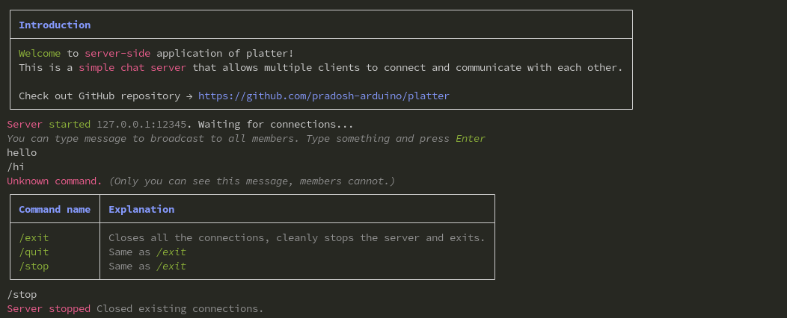
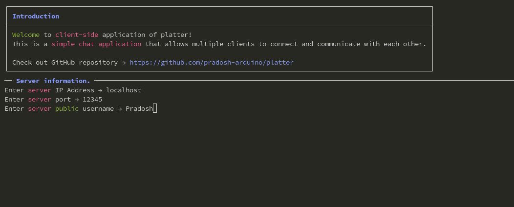
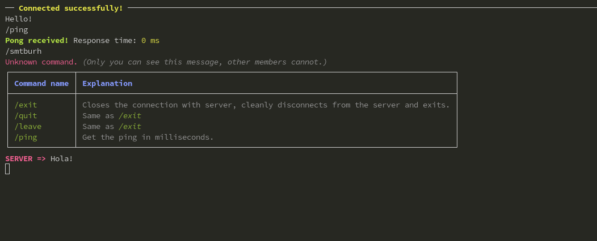

## Platter

Platter is an open-source, fast, reliable, secure chat service hosted by you! Yes you will have the full control with privacy!

### Features

- Awesome Interface
- Completely made in CLI. So you won't need a desktop manager.
- Protection against spam and limits the packet size.
- *and much more!*

### Preview
---
#### Server

---
#### Client
##### Not Connected to any server


##### Connected to any server


### Installation

*Currently working on it.**

### Usage

#### Server
1. Use dotnet to run from the source, or execute the app bundle.

2. You can type the IP Address if you want, or you can setup an `settings.json`
    - Here is an example `settings.json`
    
    ```json
    {
        "ip_address": "127.0.0.1", /* It can be any meaningful address. Names like `localhost` are not allowed and throws error Instead of localhost you can use this example. */
        "port": 12345, /* It can be any meaningful port number. */
        "max_connections": 0 /* It can be any integer value, 0 (zero) means no limit */
    }
    ```

3. You can type in the terminal from the server to broadcast to all the members.
4. You also have a list of commands, just type `/` to get the list of commands.

---
#### Client
1. Use dotnet to run from the source, or execute the app bundle.

2. Enter the required fields
    - *in the IP Address here `localhost` is supported*
3. Just type and press enter to send messages.

### Contributing

Contributions are welcome! Please follow these steps:

1. Fork the repository.
2. Create a new branch:
    ```bash
    git checkout -b feature-name
    ```
3. Commit your changes:
    ```bash
    git commit -m "Add feature-name"
    ```
4. Push to your branch:
    ```bash
    git push origin feature-name
    ```
5. Open a pull request.

### License

This project is licensed under the [License Name]. See the [LICENSE](LICENSE) file for details.